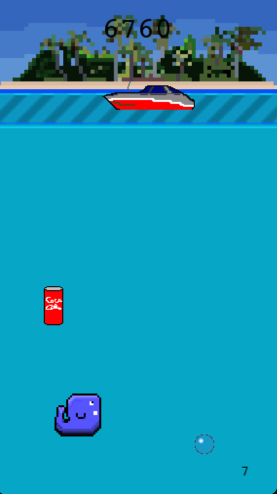

Small project in the summer of 2016, to improve at OOP and have some fun.

# Whale Game
Simply invoke
```console
python3 main.py
```
to play the game. The goal of the game is to survive as a whale swimming at
unparalleled speeds, avoiding speeding boats at the surface and litter in the
shape of cans underwater. The game ends when either
- An obstacle hits the whale.
- The whale runs out of oxygen.

Additional oxygen can be acquired by either
- Visiting the surface, where the whale can take a [fresh of breath air](https://youtu.be/b6QQ2s-wtRA?t=58s). This resets the timer.
- Running into a bubble under water. This increases the timer by a few seconds.

# Controls
The controls are quite limited:
- UP/DOWN are used to move up and down.
- SPACE is used to restart the game.
- ESC is used to exit the game. The game state, including the highscore, is gone as it is not written to disc.

# Dependencies
The game has been tested with Python 3.8.1 on a MacBook. It depends on numpy and pygame, which can be installed as follows within a virtual environment:
```console
python3 -m venv .env
source .env/bin/activate
pip3 install -r requirements.txt
```

# New in this version
State of the art code combined with an amazing concept. Is the world ready for this?
